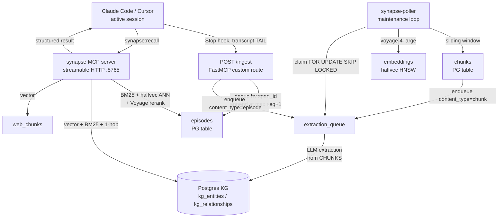
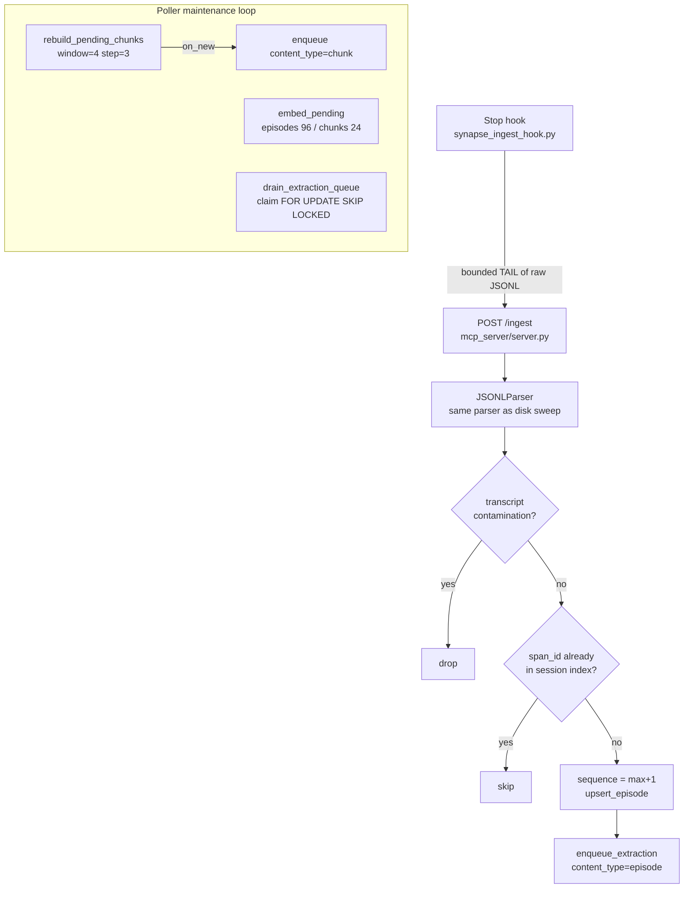
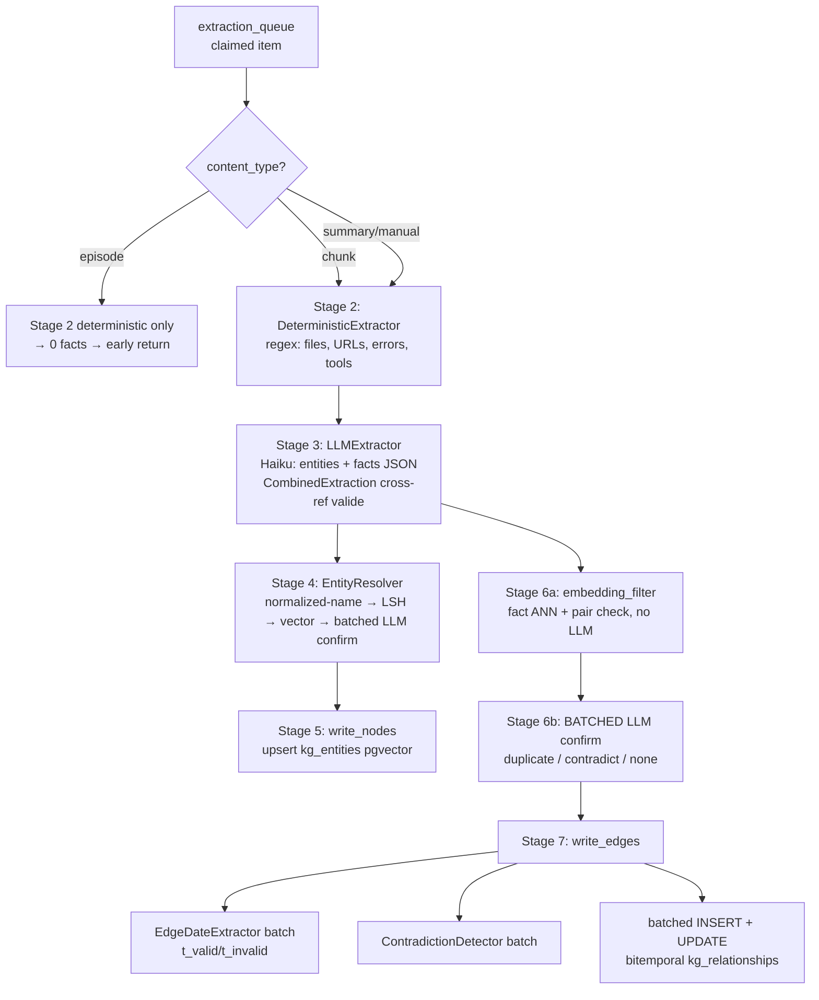
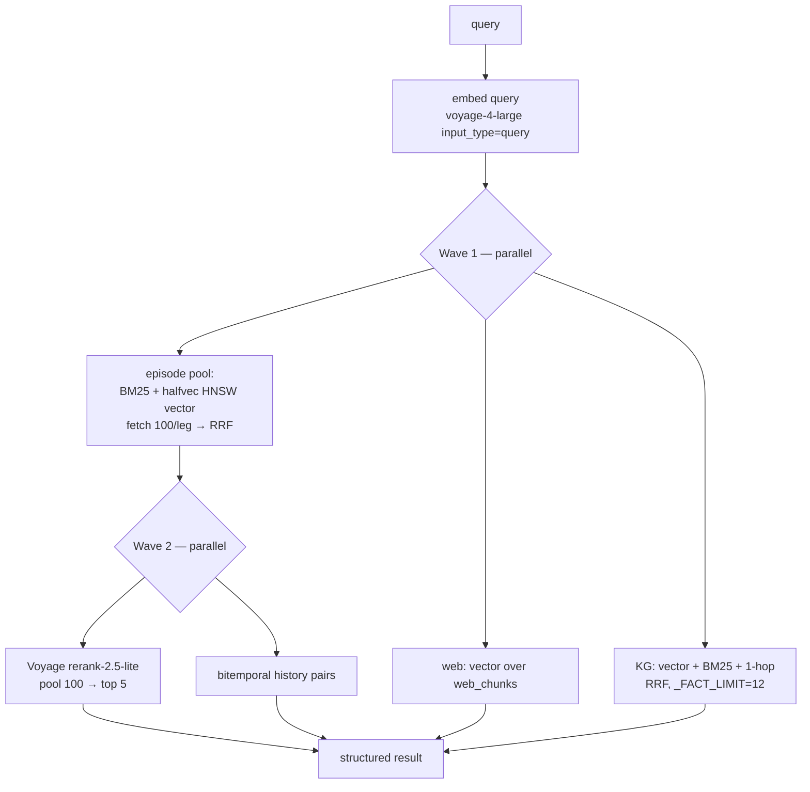

# Synapse Architecture

Synapse is a persistent episodic memory layer for AI assistants. It captures Claude Code (and Cursor) session transcripts, structures them into retrievable memory units, extracts entities and facts into a knowledge graph, and exposes everything through an MCP server that Claude Code and claude.ai call during active sessions.

**The core problem it solves**: Claude Code sessions have no memory across restarts. Every new session starts cold. Synapse bridges that gap by indexing everything that happened in past sessions and making it retrievable via hybrid search that fuses reranked episodes with knowledge-graph facts. (Recall is not instant: the query-embed and cross-encoder rerank each make a Voyage API round-trip, so end-to-end latency is typically a few seconds, dominated by those calls.)

**One-paragraph mental model**: A Claude Code `Stop` hook pushes the tail of each session transcript to an HTTP `/ingest` endpoint. Episodes land in Postgres, get grouped into overlapping chunks, and the chunks are the substrate the knowledge-graph extractor mines for entities and facts (written to a knowledge graph in Postgres). At recall time, the MCP server runs a reranked episode leg (BM25 + vector), a KG fact leg, a web-research leg, and a bitemporal history leg in parallel, and returns a compact structured result. There is **no Logfire polling, no summary layer, and no served chunk bucket** — all three were retired during 2026.

> **Status note (2026-06-05):** This document was reconciled against the live code after a large architectural drift. The headline changes from the previous version: (1) ingestion moved from Logfire SQL-API polling to a Stop-hook `/ingest` push; (2) KG facts are extracted from **chunks**, not summaries; (3) the **summary/synth-document layer is retired**; (4) the **chunk bucket is no longer served** by `recall()` — episodes are served via a deep-fetch + cross-encoder rerank; (5) a **web-research ingestion subsystem** was added; (6) halfvec HNSW vector indexes shipped; (7) edges are **bitemporal** (`t_created`/`t_valid`/`t_invalid`); (8) the Docker migration is done — all services run in Docker on the server host.
>
> **Status note (2026-06-24):** Reconciled again for the FalkorDB→Postgres KG cutover and the public-release plumbing. (1) the **knowledge graph moved into Postgres** (`kg_entities`/`kg_relationships`), FalkorDB decommissioned (#67) — §10 rewritten; (2) the **communities bucket was retired** with that cutover; (3) the MCP server runs **standalone `fastmcp` 3.4.2 with MultiAuth** (machine bearer + GitHub OAuth), which replaced the hand-rolled OAuth proxy (#166); (4) skills are **hosted in Postgres and served as `skill://` resources** with two-way sync (§7.5); (5) **26 migrations** (was 16); (6) a Claude Code **plugin + marketplace** is the distribution path.

---

## Table of Contents

1. [System Overview](#1-system-overview)
2. [Tech Stack](#2-tech-stack)
3. [Document Types](#3-document-types)
4. [Ingestion Pipeline](#4-ingestion-pipeline)
5. [Knowledge Graph Extraction](#5-knowledge-graph-extraction)
6. [Recall Pipeline](#6-recall-pipeline)
7. [MCP Server](#7-mcp-server)
8. [Web Research Subsystem](#8-web-research-subsystem)
9. [Database Schema](#9-database-schema)
10. [Postgres Graph Model](#10-postgres-graph-model)
11. [Nightly Maintenance & Dream Pipeline](#11-nightly-maintenance--dream-pipeline)
12. [Key Design Decisions](#12-key-design-decisions)
13. [Configuration](#13-configuration)
14. [File Structure](#14-file-structure)
15. [Operational Notes](#15-operational-notes)
16. [Known Gaps & Planned Work](#16-known-gaps--planned-work)

---

## 1. System Overview



**Data flow summary**:

1. A Claude Code `Stop` hook (`scripts/synapse_ingest_hook.py`) fires on every turn and POSTs a bounded **tail** of the raw session JSONL to `http://<server-host>:8765/ingest`. It runs detached and never blocks the turn. (Any other agent frontend that drives the real `claude` CLI ingests the same way.)
2. `/ingest` parses the tail, drops transcript contamination, **dedups by `span_id`**, and appends genuinely-new turns as episodes at `max(sequence)+1`, enqueuing each for KG extraction.
3. The **poller** (a maintenance loop, *not* an ingester) rebuilds sliding-window chunks, embeds pending episodes/chunks via Voyage AI, and drains the extraction queue.
4. KG extraction runs on **chunks** (3–5 turn windows): Haiku extracts entities + facts, resolves entities against the Postgres KG, dedups/contradicts against existing facts, and writes bitemporal relationship edges (`kg_relationships`).
5. When a new session calls `synapse:recall`, the MCP server runs four legs in parallel (episodes, KG facts, web, bitemporal history) and returns a compact ranked result.

**Where things run**: All Synapse services (poller, MCP server, dream) run in Docker on the **server host** alongside Postgres. Claude Code runs on the **client machine** and reaches the MCP server over the network at `http://<server-host>:8765/mcp` with a machine **bearer token**. The hosted claude.ai connector reaches the same server at a public hostname (e.g. `synapse.example.net`, via a Cloudflare tunnel) and authenticates via **GitHub OAuth** — handled by the server's own `fastmcp` **MultiAuth**, which replaced the former hand-rolled OAuth proxy (#166). Prod compose + `.env` live at a dedicated deploy path on the server host (e.g. `/opt/synapse`).

---

## 2. Tech Stack

| Component | Technology | Notes |
|-----------|------------|-------|
| Language | Python 3.12 | |
| Package manager | uv | `uv run` everywhere, no pip/venv activation |
| Relational store | PostgreSQL + ParadeDB image (server host :5432) | |
| Vector search | pgvector, `vector(2048)` columns + **halfvec(2048) HNSW** | HNSW shipped (#104); `embedding::halfvec(2048)` because pgvector HNSW caps plain `vector` at 2000 dims |
| Full-text search | ParadeDB `pg_search` (BM25) | `id @@@ paradedb.match('content', …)` |
| Graph store | PostgreSQL (`kg_entities`, `kg_relationships`) | FalkorDB **decommissioned** (#67) — the KG is Postgres-only (`ingestion.kg_client`, recall via `mcp_server.kg_pg`); bitemporal edges via `t_valid` / `t_invalid` |
| Embeddings | Voyage AI `voyage-4-large`, 2048 dims | separate `input_type` for query vs document |
| Reranker | Voyage `rerank-2.5-lite` cross-encoder (default; WIN1 measured on `rerank-2.5`) | the active ingredient in episode recall (WIN1) |
| LLM calls | `claude-agent-sdk` via `ClaudeCLIClient` / `agent_call` | `claude-haiku-4-5`; subscription OAuth token or `ANTHROPIC_API_KEY` (or an OpenAI-compatible endpoint via `SYNAPSE_LLM_PROVIDER=openai`) |
| MCP server | **standalone `fastmcp` 3.4.2**, HTTP (stateless), port 8765 | `/mcp` (tools + `skill://` resources), `/ingest` + `/recall` custom routes; **MultiAuth** (machine bearer + GitHub OAuth) |
| Ingestion trigger | Claude Code `Stop` hook → HTTP push | **replaced Logfire polling** (now removed) |
| Data models | Pydantic v2 | |
| Postgres driver | psycopg3 (`dict_row`), thread-local in recall | |
| JSON | orjson | |
| Telemetry | Logfire **emit only** | all Logfire *read/poll* paths removed (#108); spans still emitted to the configured Logfire project |
| Auth | `fastmcp` MultiAuth: `StaticTokenVerifier` (bearer) + `GitHubProvider` OAuth | machines send one bearer on every endpoint; claude.ai does GitHub OAuth on `/mcp`; **replaced the hand-rolled OAuth proxy** (#166) |
| Skills serving | machine-token `/skills/*` HTTP routes (DSN-free, two-way) + `PgSkillsProvider` `skill://` resources | skills hosted in Postgres (`skills_lane.skill_registry.body` + `skill_files`), materialized to `~/.claude/skills`; per-skill hash + `content_modified_at` reconcile, append-only `skill_history` |
| Distribution | Claude Code plugin + `.claude-plugin/marketplace.json` | `/plugin install synapse@synapse`; `userConfig` for secrets; `synapse login` issues the bearer over OAuth |

### The LLM call path (`claude-agent-sdk`)

Extraction does **not** shell out to `claude --print`. Despite the legacy class name `ClaudeCLIClient`, all LLM calls go through `claude-agent-sdk`'s `ClaudeSDKClient` + `ClaudeAgentOptions` (`ingestion/llm_client.py`). Two shapes over the same SDK:

- `ClaudeCLIClient.messages.create(...)` — a synchronous, `anthropic.Anthropic()`-shaped interface (what the extractor/dedup/contradiction/edge-date call sites use). Wrapped in tenacity retry; bridges to async via `asyncio.run`.
- `agent_call` / `agent_call_batch` — native async, used where concurrency matters.

```python
opts = ClaudeAgentOptions(
    allowed_tools=[],
    max_turns=max_turns,
    model=model,                       # "claude-haiku-4-5"
    cli_path=_CLI_PATH,
    output_format=output_format,
    max_thinking_tokens=_MAX_THINKING_TOKENS,   # 2048 (#121)
)
async with ClaudeSDKClient(options=opts) as client:
    await client.query(full_prompt)
    async for msg in client.receive_response():
        ...
```

Auth is a Claude subscription OAuth token (`CLAUDE_CODE_OAUTH_TOKEN`) or an `ANTHROPIC_API_KEY`, consumed by the spawned `claude` CLI rather than by Synapse itself. Scripting a subscription OAuth token against the raw Anthropic API is ToS-prohibited; the SDK/CLI subprocess is the sanctioned path. Extraction is Haiku-only — ~10x cheaper than Sonnet and sufficient for short structured classification.

---

## 3. Document Types

Synapse keeps three **live** document substrates plus the KG. Episodes are the served retrieval workhorse; chunks are the KG extraction substrate; web chunks are the web-research substrate. The summary/dream layer is **retired**.

### 3.1 Episodes — the served workhorse

**One episode per user-initiated exchange.** Each captures a single human turn: a short orientation prefix (the prior assistant response), the new user message, all tool calls and results, and the final assistant response.

```
[context] truncated previous assistant response — orientation anchor
[user]    the human message text
[tool:Bash] command string
[result] tool output
[assistant] final response text
```

**Why human-turn granularity, not per-API-call**: Claude Code makes 3–8 API calls per user turn (each tool result requires re-submission). A 1:1 span→episode mapping produces ~63% assistant-only fragments with no human context and weak embeddings. Grouping by the human-message boundary gives coherent units. Episodes are served directly by `recall()` (BM25 + vector, reranked) — they own both broad and needle retrieval.

**Stored in**: `episodes`. Key columns: `session_id`, `sequence`, `project`, `platform`, `content`, `embedding vector(2048)`, `human_turn`, `assistant_turn`, `span_id` (dedup key), `retrieval_count`, `source`.

### 3.2 Chunks — the KG extraction substrate

**Sliding window of 4 consecutive episodes, step 3 (1-episode overlap).** Only complete windows are written, so a chunk is created once and never superseded.

**Role**: Chunks are **not served by `recall()`**. They exist solely as the substrate the KG extractor mines for facts — a 4-episode window carries enough context (question → attempts → errors → resolution) to extract quality entities and relationships, where a single thin turn ("ok, continue") does not. Measured ~2.66 quality-weighted facts/episode from chunks vs much lower from episode-level or summary-level extraction (#63).

**Stored in**: `chunks`. Key columns: `session_id`, `start_sequence`, `end_sequence`, `episode_ids JSONB`, `content` (episodes joined by `---`), `embedding vector(2048)`. Idempotent on `(session_id, start_sequence, end_sequence)`.

### 3.3 Web artifacts & web chunks — the web-research substrate

Web-research tool results (WebFetch, Exa, Firecrawl, WebSearch) are captured as first-class rows so past research is recallable. A `web_artifacts` row is the captured page/search/job; `web_chunks` are its embedded slices (with an optional contextual-retrieval prefix). The `web` bucket in `recall()` is served from `web_chunks`. See [§8](#8-web-research-subsystem).

### 3.4 Knowledge graph (Postgres)

`kg_entities` rows and bitemporal `kg_relationships` fact edges (migrated out of FalkorDB in #67). The KG is the relational/multi-hop specialist served as side buckets (`facts`, `entities`), never the primary retrieval path. See [§10](#10-postgres-graph-model).

### 3.5 Retired: summaries & dream documents

`synth_documents` (`doc_type='summary'|'dream'`) is a **frozen legacy table** (~669 stale rows). Nothing generates new rows, `recall()` never serves them, and they are no longer the KG extraction substrate. Residual scaffolding remains (an embedding leg in the poller that finds nothing, `summary` branches in the extractor, and a count in `list_projects`) pending a snapshot + purge. Treat the summary layer as **dead**; the episode leg and KG facts absorbed both its broad-recall and relational jobs.

---

## 4. Ingestion Pipeline

Episodes enter Synapse through exactly one live path: a Claude Code `Stop` hook that POSTs a transcript tail to `/ingest`. **There is no Logfire polling** — `ingestion/logfire_client.py` no longer exists, and Logfire is used only to *emit* telemetry.



### 4.1 The `/ingest` endpoint

A Starlette custom route on the FastMCP server: `@mcp.custom_route("/ingest", methods=["POST"])`. The Stop hook posts `{"records": [...], "source": "hook"}`; the body is parsed with the same `JSONLParser` the disk-sweep backstop uses. The dedup loop:

```python
for ep in episodes:
    if is_transcript_contamination(ep.content):    # reject known PII-bearing payloads
        dropped += 1; continue
    if ep.session_id not in index:
        index[ep.session_id] = db.get_session_span_index(ep.session_id)   # (seen span_ids, max_seq)
    seen, max_seq = index[ep.session_id]
    if not ep.span_id or ep.span_id in seen:
        continue                                   # no identity, or already stored — skip
    max_seq += 1
    ep.sequence = max_seq                          # the tail's positional seq is discarded
    seen.add(ep.span_id)
    eid = db.upsert_episode(ep)
    if ep.content and ep.content.strip():
        db.enqueue_extraction(ExtractionItem(episode_id=eid, session_id=ep.session_id,
                                             content=ep.content, content_type="episode", project=ep.project))
```

- **Dedup by `span_id`** — a turn's stable last-record UUID. The session's `(seen span_ids, max_seq)` index is loaded once per session. The tail's own positional sequence is discarded (a tail renumbers from 1 and would collide).
- **Append at `max(seq)+1`** — new turns extend the session.
- **Contamination filter** — `is_transcript_contamination` drops PII-bearing third-party transcript payloads (produced by another agent project sharing the same hooks).
- Runs in a threadpool so the async route never blocks.

### 4.2 The Stop hook

`scripts/synapse_ingest_hook.py` fires on every turn. It ships a **bounded tail** (default `SYNAPSE_INGEST_TAIL=400` raw records), trimmed to start at a real turn boundary; if the window holds no boundary (one mega-turn) it falls back to the full file. It POSTs detached (`start_new_session=True`) and always `sys.exit(0)` — **it never blocks or fails a turn**. A disk-sweep backstop re-ingests anything a failed POST drops. Shipping a tail (not the full transcript) plus enqueue-gating on new `(session, span_id)` fixed an earlier O(turns²) re-extraction loop (#61, #105, #106).

### 4.3 Chunk construction

Lives in `ingestion/chunks.py`. `_CHUNK_WINDOW = 4`, `_CHUNK_STEP = 3` → 1-episode overlap. Only complete windows are emitted (`range(0, n - window + 1, step)`); partial trailing windows wait until full. When the poller rebuilds chunks, an `on_new` callback enqueues each genuinely-new chunk for extraction with `content_type="chunk"` — exactly once, at birth. Idempotent via `ON CONFLICT (session_id, start_sequence, end_sequence) DO NOTHING`.

### 4.4 Extraction-queue enqueue gating

`enqueue_extraction` is the idempotency backstop, with branches keyed by item shape (all checking only `status IN ('pending','processing')`):
- **episode/manual** (have `episode_id`) — dedup by `episode_id`.
- **chunk** — dedup by exact `(session_id, content)` (not `(session_id, content_type)`, which would collapse every chunk of a session into one row).
- **summary/manual session-keyed** — dedup by `(session_id, content_type)`.

### 4.5 Poller maintenance loop

The poller (`ingestion/poller.py`) owns **post-ingest work only** — it does not ingest episodes. Each cycle:

1. `rebuild_pending_chunks()` — only for sessions whose episodes outgrew their chunks (cheap pre-filter).
2. `embed_pending()` — unembedded episodes (batch 96), chunks (batch 24), and any synth_docs (batch 24, normally empty).
3. `drain_extraction_queue(batch_limit=8)` — claim and process queue items.
4. Periodic `release_stale_claims()` sweep.

It uses **adaptive sleep** (3s when backlog is likely, 60s otherwise), defers the full chunk/embed cycle when the extraction backlog is large, and backs off exponentially on `UsageLimitError` (quota). `SYNAPSE_DRAIN_ONLY=1` turns a replica into a pure extraction worker.

### 4.6 Horizontal scaling: atomic claim

Multiple poller replicas claim distinct queue slices atomically (#37):

```sql
UPDATE extraction_queue
SET status = 'processing', claimed_at = now()
WHERE id IN (
    SELECT id FROM extraction_queue
    WHERE status = 'pending'
    ORDER BY priority ASC, enqueued_at ASC     -- priority lane (#015): new ingest 0 before backfill 10
    LIMIT %s
    FOR UPDATE SKIP LOCKED
)
RETURNING *;
```

`priority` (schema 015) keeps a bulk backfill (priority 10) from starving fresh turns (priority 0). `claimed_at` (schema 016) lets `release_stale_claims(older_than=45min)` recover crashed-worker orphans without clobbering a live peer mid-batch.

### 4.7 Embedding

Voyage `voyage-4-large`, 2048 dims. `input_type="query"` at recall time, `"document"` for all ingestion content. Token-aware batching packs requests under Voyage's 120K-token cap (target 100K, max 1000 items, 24K-char per-item cap). Per-doc-type poller batch sizes: episodes 96, chunks 24 (~4x longer), synth_docs 24.

---

## 5. Knowledge Graph Extraction

KG facts are extracted from **chunks**, not summaries. `ExtractionPipeline.process_item()` orchestrates per queue item; the heavy per-fact stages are **batched into one LLM/SQL call each** across all of an item's facts.



### 5.1 content_type gating

```python
if content_type == "episode":
    det_entities = self._stage2_deterministic(...)        # deterministic only
    llm_result = ExtractionResult(entities=[], facts=[])  # NO LLM → 0 facts → early return
elif content_type == "chunk":
    det_entities = self._stage2_deterministic([{"content": content, "metadata": {}}])
    llm_result = self._stage3_llm(content, det_entities)  # full extraction on the window
else:  # summary or manual
    episodes_raw = self._db.get_session_episodes(session_id) if session_id else []
    det_entities = self._stage2_deterministic(episodes_raw)
    llm_result = self._stage3_llm(content, det_entities)
```

**Chunks are the live fact source.** Episodes get deterministic-only extraction, which produces zero facts and returns early (the old "LLM extraction only on summaries" rule is dead). The `summary`/`manual` branch remains for back-compat and the `remember()` tool, but no summaries are enqueued anymore.

### 5.2 Stages

- **Stage 2 — `DeterministicExtractor`**: regex/metadata extraction of `File` / `URL` / `Issue` / `Tool` entities. No LLM.
- **Stage 3 — `LLMExtractor`**: one Haiku call → residual entities + facts, validated through a `CombinedExtraction` Pydantic cross-ref validator that drops facts referencing undeclared entities.
- **Stage 4 — `EntityResolver`**: resolve each entity to an existing node or mint a UUID. Strategy ladder: exact `normalized_name` → entropy gate → MinHash/LSH → **batched** Haiku "same entity?" confirm. See [§5.3](#53-entity-resolution).
- **Stage 5 — write nodes**: upsert kept (non-orphan) entities into `kg_entities` with pgvector embeddings.
- **Stage 6a — embedding filter**: no-LLM candidate find. A `pair_pool` (edges sharing the new fact's exact source+target) + a `semantic_pool` (RRF of vector + BM25 over fact text). `_SEMANTIC_POOL_LIMIT = 8` (#121, down from 20 — the rank 9–20 tail was noise and pushed the dedup prompt to ~30K tokens).
- **Stage 6b — batched LLM confirm**: ONE Haiku call classifies every fact-with-candidates as `duplicate` / `contradict` / `none`.
- **Stage 7 — write edges**: three batched helpers — `EdgeDateExtractor.extract_batch` (one call for all `(valid_at, invalid_at)`), `ContradictionDetector.detect_contradictions_batch` (one call for same-pair live-edge contradictions), then `invalidate_edges_batch` + `create_edges_batch` (one batched SQL statement each).

Batched stages (one call across the item's facts): Stage-4 confirm, 6b, EdgeDateExtractor, ContradictionDetector, Stage-7 writes/invalidations (#38, #40, #42, PR #83/#94). Per-item single passes: 2, 3, 5, 6a.

### 5.3 Entity resolution

**Write-path** (`EntityResolver`): pgvector returns cosine *distance* → `similarity = 1 - distance`. `< 0.85` → new node; `≥ 0.95` → trust the embedding, skip the LLM; `0.85–0.95` → batched Haiku confirm. On any error, every pending entity becomes a **new** node — a spurious duplicate is cheap, a wrong merge corrupts the graph.

**Semantic identity merge** (#48) handles lexically-*different* same-entities. Three lanes: exact-name (auto), moderate (cosine ≥ 0.95 **and** Levenshtein ratio ≤ 0.30 → Haiku confirm), and semantic (embedding-only, no name gate — the only lane that can reach `User` ≡ the user's real name). Winner is deterministic (most edges → oldest → lowest uuid); merge re-creates every edge with the full bitemporal quad.

> **Open gap (#49):** the semantic lane is **detection-only — it never auto-merges**. Hub-touching pairs (degree ≥ 50) are surfaced for human review because a wrong hub merge is irreversible. So identity hubs still re-fragment: `User` / the user's first name / the user's full name / `The User` persist as separate nodes (~2065 edges across 6 nodes). External research independently names entity resolution *the* hard problem of KG memory — this is the load-bearing fix to keep cheap. See [§16](#16-known-gaps--planned-work).

### 5.4 Bitemporal edges

`kg_relationships` edges are bitemporal (#47). The canonical quad — written alongside legacy single-field mirrors for backward-compatible readers:

- `t_created` (== `created_at`) — write time, never updated.
- `t_valid` (== `valid_at`) — when the fact began being true; from `EdgeDateExtractor` or `now()`.
- `t_invalid` (== `invalid_at`) — when the fact stopped being true; **absent/NULL on create**, set on contradiction.
- `t_expired` — reserved for future selective forgetting; nothing writes it yet.

Contradictions **invalidate the old edge** (an `UPDATE` setting `invalid_at`/`t_invalid`) and always write the new one — they never block it. All live-edge read filters use `t_invalid IS NULL`. This gives a queryable history of fact evolution (surfaced by recall's `history` leg).

`EdgeDateExtractor` (#46) skips the LLM for any fact with no date signal via a `_TEMPORAL_RE` regex prefilter (years, ISO/slash dates, month/weekday names, "yesterday/since/until", durations, "started/stopped/no longer/used to", …) — a non-temporal fact resolves to the `now()` fallback identically, so the call is wasted.

---

## 6. Recall Pipeline

`recall()` runs four legs (three concurrent, then a two-leg second wave) over a persistent `ThreadPoolExecutor(max_workers=4)` and returns a **compact, conditionally-populated** result.



### 6.1 Return shape

```python
out = {"query": query, "facts": facts}   # always present (facts may be [])
if episodes_served: out["episodes"]    = [...]   # reranked, cap 5
if entities_bucket: out["entities"]    = [...]   # {name, summary}, cap 3
if web_chunks:      out["web"]         = [...]   # {context|excerpt, url?, title?, date?}, cap 3
if history:         out["history"]     = [...]   # {previously, now}, cap 2
return out
```

`chunks`, `summaries`, and the `communities` bucket are **not** returned (chunks/summaries retired in #63; communities retired with the #67 KG cutover, never measured as contributing). Keys are present only when their bucket is non-empty (`query` and `facts` always present).

### 6.2 Episode leg (the workhorse)

Two sub-legs deep-fetch 100 candidates each, fuse, then a cross-encoder reranks:

- **BM25** (ParadeDB): `WHERE id @@@ paradedb.match('content', %s) ORDER BY paradedb.score(id) DESC`.
- **Vector** (halfvec HNSW, #104): `ORDER BY embedding::halfvec(2048) <=> %s::halfvec(2048)` — the cast must match the index expression *verbatim* to be served by HNSW. `SET hnsw.ef_search = 200` per connection (default 40 under-recalls a 100-deep fetch). This took episode vector search from ~878ms to ~15–23ms (38x) at recall@10 = 1.000 vs exact scan.
- **Fusion** (`_merge_rrf`): RRF `k=60` × recency decay (half-life 30 days) × feedback boost (`min(2.0, 1 + log1p(retrieval_count)·0.3)`).
- **Rerank (WIN1)**: the fused 100-pool goes to Voyage `rerank-2.5-lite` by default (WIN1 measured on `rerank-2.5`); top `_RECALL_EPISODE_LIMIT = 5` served in pure rerank order. The reranker is the active ingredient — deeper RRF alone can't lift a rank-40 gold; the cross-encoder can. Degrades gracefully to RRF order on reranker error (recall never hard-fails). Lifted answerability 90.5%→95.2%, exact-gold hit +7pts, served tokens −20%.

### 6.3 KG fact leg (`_search_kg`)

Three candidate lists over Postgres (`kg_relationships`), all filtering `t_invalid IS NULL`, fused by a separate RRF (`k=1`, no recency/feedback):
1. **Fact-embedding vector** over `kg_relationships.fact_embedding` (halfvec HNSW, partial on `t_invalid IS NULL`).
2. **BM25 fulltext** (ParadeDB) over fact text.
3. **1-hop join** from seed entities via `src_uuid`/`tgt_uuid`.

Seed entities come from a pgvector KNN over `kg_entities.embedding` (halfvec HNSW, fetch 25), degree-gated (drop orphans), capped at 8, with a `session_focus` bonus (0.3 subtracted from distance when a seed's name/uuid is in the caller-supplied focus set). `_FACT_LIMIT = 12` (#100 — doubled exact-fact keyword recall 0.119→0.214 at zero graph bloat). Returns `(facts, seed_entities)`; seeds feed the `entities` bucket.

### 6.4 Web & history legs

- **Web**: vector-only over `web_chunks` (BM25-over-web caused cross-domain token collisions), joined to `web_artifacts` for url/title, deduped to one chunk per parent page. Cap 3.
- **History**: bitemporal `{previously, now}` pairs for facts whose edges were surfaced — the supersession story flat vector search can't tell. Cap 2.

### 6.5 Parallelism

Wave 1 (`_episode_pool`, web, KG) fans out on the leg executor; Wave 2 (Voyage rerank HTTP + KG history) runs concurrently. PG connections are thread-local. A separate single-worker executor handles fire-and-forget `retrieval_count` writes. This took `recall()` from ~2.85s to ~1.3s (#60, #103, #104).

---

## 7. MCP Server

**Standalone `fastmcp` 3.4.2** (migrated off the SDK-bundled `mcp.server.fastmcp` in 2026-06, PR #166), HTTP transport with `stateless_http=True`, bound `0.0.0.0:8765`, MCP at `/mcp`. A `--stdio` flag switches to stdio on localhost. Stateless HTTP means each call is a short-lived request with no state to lose on container restart or client sleep/wake. The standalone package brought first-class **auth** ([§7.4](#74-auth)) and a **skills provider** ([§7.5](#75-skills-serving)) that the bundled one lacked.

### 7.1 Tools

- **`recall(query, project=None, session_focus=None, group_id="technical")`** — the primary retrieval tool ([§6](#6-recall-pipeline)).
- **`recall_episodes(query, project=None, limit=5)`** — raw episode drill-down (same deep-fetch + rerank machinery, served to `limit`).
- **`remember(content, project=None, session_id=None)`** — writes a manual `Episode` (`source="manual"`, `content_type="manual"`) and enqueues full KG extraction. Returns `{status, episode_id, session_id}`.
- **`list_projects()`** — per-project episode counts + last activity (still reports legacy summary/dream counts).
- **`query_graph(query, group_id="technical", limit=20)`** — experimental NL→SQL over the KG tables via Haiku (always filters `r.t_invalid IS NULL`), returns `{sql, results, count}`. Not for automated pipelines — use `recall()`.
- **`issue_machine_token()`** — returns the shared machine bearer token, auth-gated by MultiAuth + the allowlist; lets `synapse login` fetch it over OAuth instead of a manual copy-paste ([§7.4](#74-auth)).

### 7.2 Custom HTTP routes (`/ingest`, `/recall`)

`/ingest` and `/recall` are Starlette **custom routes**, not MCP tools (they won't appear in the tool list), so the hook scripts can hit them with a one-shot `urllib` POST instead of an MCP handshake. `/ingest` is the Stop-hook push endpoint ([§4.1](#41-the-ingest-endpoint)); `/recall` serves non-MCP HTTP callers that want recall results without an MCP handshake (same engine as the `recall` tool, `write_feedback=False`). fastmcp's auth deliberately does **not** gate custom routes (they're intended for unauthenticated ops endpoints — [issue #3704](https://github.com/jlowin/fastmcp/issues/3704)), so each handler does its own constant-time bearer check against `SYNAPSE_MACHINE_TOKEN` ([§7.4](#74-auth)). A health helper returns `{"status": "ok"}` for container probes.

### 7.3 Lazy init & connection resilience

The `Recall` engine and its Postgres/Voyage clients initialize lazily on first call. `_ensure_pg()` probes live connections with `SELECT 1` before trusting `conn.closed=False`, so half-open TCP connections (PG restart, network blip) are detected and reconnected transparently.

### 7.4 Auth

`fastmcp` **MultiAuth** composes two credentials on the one `/mcp` endpoint (PR #166, which retired the 636-line hand-rolled OAuth proxy):

- **`StaticTokenVerifier`** — a single shared **machine bearer** (`SYNAPSE_MACHINE_TOKEN`, scope `user`). Every machine client (the hooks, Claude Code `--header`, the API `mcp_connector`) sends it, and it also gates the custom routes. One token, every endpoint.
- **`GitHubProvider`** (an `OAuthProxy`) — the **claude.ai web-connector** path. fastmcp emits the OAuth 2.1 discovery metadata + the DCR `/register` endpoint claude.ai needs and bridges to GitHub login. An `on_call_tool` middleware enforces `ALLOWED_GITHUB_USERS` (GitHubProvider has no built-in allowlist — without it, any GitHub account could read the memory).

Auth is **env-gated**: with no `SYNAPSE_MACHINE_TOKEN` the server runs open (dev/stdio). The plugin's `synapse login` fetches the bearer via the `issue_machine_token` tool — issuance is a one-time approval, usage stays a static header.

**`synapse login` — device flow (default).** The original loopback authorization-code flow needed an interactive browser on the *same host* as the CLI — wrong for servers/headless boxes (and `GitHubProvider.allowed_client_redirect_uris` originally allowed only the claude.ai/claude.com callbacks, so the CLI's `127.0.0.1` redirect was rejected outright until loopback patterns were added). Login now defaults to the **OAuth 2.0 Device Authorization Grant** (RFC 8628), served by `mcp_server/device_routes.py` as two unauthenticated bootstrap routes that **proxy GitHub's native device flow**:

- **`POST /device/code`** → calls GitHub's `login/device/code`, returns `{user_code, verification_uri, device_code, interval}` to the client.
- **`POST /device/token`** → polls GitHub's token endpoint with the `device_code`; on approval it reads the GitHub login and enforces `ALLOWED_GITHUB_USERS` (same gate as the web leg) before returning `{token: SYNAPSE_MACHINE_TOKEN}`. Stateless — the `device_code` lives on the client and is replayed each poll; no server-side state, no redirect URIs.

The user approves at `github.com/login/device` on **any device**; no same-host browser. Requires "Enable Device Flow" on the GitHub OAuth App. The legacy browser flow remains behind `synapse login --browser`. **Client config needs no env vars**: `plugin/scripts/config.py` resolves `SYNAPSE_URL`/token in order — explicit env → `CLAUDE_PLUGIN_OPTION_*` (injected for hooks/MCP, *not* for command-run scripts) → the install-prompt value in `settings.json` (`pluginConfigs."synapse@<marketplace>".options`) → default. The plugin also ships a `bin/synapse-login` launcher (on Claude Code's session PATH) so `! synapse-login` runs it with no model in the loop.

### 7.5 Skills serving

The server hosts the skill library in Postgres (`skills_lane.skill_registry.body` + `skill_files`). The **Synapse plugin** reaches it over machine-token-gated **HTTP routes** — `mcp_server/skill_sync_routes.py`: `/skills/list`, `/skills/fetch`, `/skills/publish`, `/skills/overwrite` (sync) and `/skills/proposals[/act]` (review). This is the **DSN-free seam**: a client needs one base URL + a bearer, never a database connection. The same content is *also* exposed as native fastmcp **`skill://` resources** via `PgSkillsProvider` (`mcp_server/skills_provider.py`) for any generic fastmcp client (`skill://{name}/SKILL.md`, `/_manifest`, `/{path}`).

The plugin's `SessionStart` hook **materializes** skills to `~/.claude/skills` (where they become native Claude Code skills) and **publishes** local edits back: a per-skill whole-skill hash decides *if* a skill changed, `content_modified_at` decides *which side is newer* (pulls `os.utime` the files so "newest" tracks the edit, not the sync). Every superseded body is logged to an append-only `skill_history` table (a PG trigger on server writes + a `/skills/overwrite` snapshot for a local edit that never reached the server). Postgres is the single source of truth; the **dream→skills lane** ([§11](#11-nightly-maintenance--dream-pipeline)) writes it, so the central dream pipeline can improve a skill and have it sync back out.

---

## 8. Web Research Subsystem

Web-research tool results are captured so prior research is recallable, mirroring the Anthropic Contextual Retrieval pattern.

- **`web_artifacts`** (schema 011) — one row per web tool result, `kind`-discriminated over `web_scrape | search_result_set | research_job_ref`. Dedup key `tool_use_id` (UNIQUE). Holds url/title/markdown for scrapes, `items JSONB` for search result sets, research-job refs for deep research. BM25-indexed on title + markdown + query. No embedding column (embeddings live in chunks).
- **`web_chunks`** (schema 012) — 1:N embedded slices (`voyage-4-large`, 2048), `ON DELETE CASCADE` from the artifact. BM25-indexed; halfvec HNSW (schema 014).
- **`web_chunk_context`** (schema 013) — a `context_prefix` column: a 50–100 token Haiku-generated context blurb prepended before embedding (Contextual Retrieval) to lift recall. `''` = trivial doc, NULL = not yet contextualized; filled by `scripts/contextualize_web_chunks.py`.

`recall()` serves the `web` bucket vector-only from `web_chunks`, joined to artifacts, deduped per page.

**How it's fed — external cron, not in-process.** Web capture is **not** a compose service, and nothing in the `/ingest` hook or poller calls it. A **cron on the client machine** (a scheduled client-side job, every ~5 minutes) walks the session JSONLs and runs the pipeline end-to-end: parse web tool_results → `web_artifacts` (idempotent by `tool_use_id` + a per-file mtime checkpoint in `ingestion_state`, `source='web:<path>'`) → chunk (`web_chunker.py`) → contextualize (Haiku prefix via `scripts/contextualize_web_chunks.py`) → embed. So the subsystem is effectively **live with a ~5-minute lag**, not captured inside the turn. Current state (2026-06-05): **1,336 artifacts / 3,898 chunks, all embedded and contextualized, spanning 2026-05-14 → present.** Making capture truly in-process (within the `/ingest` turn) is the one remaining piece.

---

## 9. Database Schema

Migrations are numbered SQL files applied manually (no runner — small project). Twenty-six migrations to date:

- **001–009** — base: `episodes`, `extraction_queue`, `ingestion_state` (001); `span_id` (002); voyage dims 3072→2048 (003); session embeddings, now deprecated (004); ParadeDB BM25 (005); `retrieval_count` (006); drop old `session_summaries` (007); `chunks` (008); `synth_documents` (009, now legacy).
- **010 `memory_proposals`** — sink for dream stage-3 auto-memory proposals (status workflow `pending→posted→approved/rejected→applied`, Discord review). Substrate retired, so dormant.
- **011 `web_artifacts`** — web-research capture ([§8](#8-web-research-subsystem)).
- **012 `web_chunks`** — embedded web slices.
- **013 `web_chunk_context`** — contextual-retrieval prefix column.
- **014 halfvec HNSW** — `episodes.embedding` and `web_chunks.embedding` indexed as `hnsw ((embedding::halfvec(2048)) halfvec_cosine_ops) WHERE is_embedded = TRUE`. `synth_documents` and `chunks` deliberately left on exact scan (tiny/unused).
- **015 `extraction_queue.priority`** — priority lane (new ingest 0 < backfill 10) + partial claim index.
- **016 `extraction_queue.claimed_at`** — stale-claim sweep support.
- **017 `kg_entities` + `kg_relationships`** — the knowledge graph **in Postgres** (the FalkorDB→PG migration target, #67). `owner_id` multi-tenant seam; halfvec HNSW on entity embeddings and on live-fact embeddings (partial `WHERE t_invalid IS NULL`); ParadeDB BM25 on fact text; the full bitemporal quad on edges.
- **018 web→KG lane** — web-artifact extraction into the KG.
- **019 `kg_relationships.mention_count`** — fact re-assertion signal, bumped at the Stage-7 dedup-skip.
- **020 entity-type taxonomy** — data-driven 2-level supertype/subtype (`kg_supertypes`, `kg_entity_types` tables + `entity_supertype`/`entity_subtype` columns).
- **021 `recall_metrics`** — fire-and-forget recall telemetry, one row per `recall()` / `recall_episodes()`.
- **022–023 `skills_lane`** — dream→skills candidate ledger, firing log, skill registry, scan cursor (022); ledger hardening with the grounded-signal CHECK constraint (023).
- **024–026 skill serving + sync** — `skill_registry` body/scope/status + `skill_files` (024); `content_modified_at` for two-way sync (025); append-only `skill_history` + trigger (026).

Key live tables: `episodes`, `chunks`, `extraction_queue` (status `pending|processing|done|failed`, `priority`, `claimed_at`), `kg_entities`, `kg_relationships`, `web_artifacts`, `web_chunks`, `ingestion_state`, and the `skills_lane.*` schema. `synth_documents` and `memory_proposals` exist but are dormant.

---

## 10. Postgres Graph Model

The graph is **two Postgres tables** (`kg_entities`, `kg_relationships`, schema 017), not a separate database. FalkorDB was decommissioned in #67 after the cutover measured quality-equal on the relational golden set (delta −0.017, CI spans zero; `scripts/ab_kg_pg_quality.py`) and removed a moving part. Scope is selected by `group_id` (**`technical`** default, **`personal`**); `owner_id` (default `'default'`) is the forward-compatible multi-tenant seam, so a write can never land unscoped.

**`kg_entities`**:
```sql
kg_entities (
    uuid, owner_id, group_id, project,
    name, normalized_name,         -- normalized_name = lower/trim/punct-stripped dedup key (NOT unique; #49)
    entity_type,                   -- raw LLM type; entity_supertype/entity_subtype = the 2-level taxonomy (#020)
    summary,
    embedding vector(2048),        -- Voyage embedding of the entity NAME
    degree,                        -- live-edge degree (the orphan gate at recall)
    t_created, t_valid             -- + legacy created_at/valid_at mirrors
)
```

**`kg_relationships`** (bitemporal):
```sql
kg_relationships (
    uuid, owner_id, group_id,
    src_uuid, tgt_uuid,            -- entity uuids, matched at read time (not FKs: an edge can be written before its endpoints)
    name,                          -- predicate verb (uses, implements, causes, replaces, depends_on, ...)
    fact,                          -- full searchable statement
    fact_embedding vector(2048),   -- Voyage embedding of the FACT text
    episodes JSONB,                -- provenance: source episode ids
    mention_count,                 -- re-assertion count, bumped at the dedup-skip (#019)
    retrieval_count,
    t_created, t_valid, t_invalid, t_expired   -- bitemporal quad (+ legacy mirrors); t_invalid NULL = live
)
```

**Indexes**: **halfvec(2048) HNSW** on `kg_entities.embedding` (partial `WHERE embedding IS NOT NULL`) and on `kg_relationships.fact_embedding` (partial `WHERE t_invalid IS NULL` — only live facts are ANN-searchable); **ParadeDB BM25** on `kg_relationships.fact`; btree on the `(owner_id, group_id, normalized_name)` alias lookup and the per-pair `(owner_id, group_id, src_uuid, tgt_uuid)` lookup (the contradiction detector's lock target).

> **Partial-index gotcha (the Postgres analog of the old FalkorDB `efRuntime` trap):** the live-fact HNSW index is **partial on `t_invalid IS NULL`**, so dead edges are never in the index and there is no prefilter-then-filter under-return (FalkorDB's default `efRuntime=10` returned zero rows on 39% of queries after the dead-edge post-filter). As with episodes (§6.2), the query's halfvec cast (`fact_embedding::halfvec(2048)`) must match the index expression *verbatim* to be served by HNSW.

**Graph shape**: ~41K entities, ~72K relationships (~59K live). Episodes live in Postgres alongside the graph, so there are no `MENTIONS`/episodic edges — the KG is a fact+entity store queried as pgvector-KNN + BM25 + 1-hop join, not a deep-traversal graph (measured: depth dilutes recall for this workload). Community clustering was retired with the cutover ([§3.4](#34-knowledge-graph-postgres), [§6.1](#61-return-shape)).

---

## 11. Nightly Maintenance & Dream Pipeline

> **Honest status:** the `dream` container's daily `run_once()` now runs the **dream→skills lane** (`dream/skills/`, gated on `SKILLS_LANE_ENABLED=1`): mine episodes → judge → candidate ledger + drafts → consolidate-overlap nominations, reading its catalog from `skills_lane.skill_registry` (no disk). The lane moved here from the plugin so the server owns it (the plugin is now a thin client that publishes skills to the registry + reviews proposals). The legacy memory-proposal stages 2/3 remain **retired** (they read `doc_type='summary'`, no longer generated) and only run with an explicit `--stage`. The lane import is lazy + guarded so a lane error can't crash the loop.

The real KG-hygiene and web-capture work runs as **independent entry points** (scheduled externally — a client-machine cron for the web-capture lane, plus server-host systemd timers), not orchestrated by `dream/__main__`:

- **Semantic identity merge** (#48, [§5.3](#53-entity-resolution)) — exact-name and moderate (name-gated) pairs auto-merge on the write path; the lexically-different semantic lane is detection-only, surfaced for human review (the #49 gap). The former standalone `dream/entity_dedup` pass was removed in #67.
- **Communities** — **legacy/retired.** `Community` clusters (Raghavan label propagation) and `HAS_MEMBER` edges lived in FalkorDB; the bucket was retired with the #67 KG cutover (never measured as contributing), so there is no runnable module and no Postgres target.
- **Cursor ingest** — the live path is `ingestion/cursor_sqlite_client.py` (`CursorSQLiteParser`) + `cursor_sqlite_backfill.py`, emitting real `Episode` rows (`platform="cursor"`). Note: `dream/cursor_parser.py` is **legacy/dead** (no caller) — don't cite it.

**Stage 2's one live side-effect** (only if explicitly invoked, which the schedule never does): `_refresh_entity_summaries` rewrites the top-20 dense `Entity.summary` per group from connected facts. Worth knowing it exists; it is dormant in practice.

**Logfire**: all *read* paths were removed (#108) when Logfire ingestion was ripped out — the old Stage-1 Logfire reviewer is gone, episodes now arrive via `/ingest`. Logfire **emit** (telemetry spans) is retained; the `dream` and `mcp-server` containers still set `LOGFIRE_TOKEN` (spans land in the configured Logfire project).

---

## 12. Key Design Decisions

### 12.1 Hybrid retrieval, episodes primary, KG as a side specialist

`recall()` serves a reranked **episode** leg as the workhorse and the **KG facts** as a side specialist for relational/multi-hop queries — the graph is never the primary retrieval path. This matches the 2026 field consensus (see [§12.7](#127-why-a-thin-graph-not-graph-maximalist)).

### 12.2 Stop-hook push over Logfire polling

**Decision**: episodes enter via a `Stop`-hook tail POST to `/ingest`, not a Logfire SQL-API poll.
**Rationale**: polling Logfire added a 5-minute latency floor, a read dependency on a telemetry vendor, and a watermark/dedup surface. A push hook ingests within the turn, dedups by stable `span_id`, and removed an entire client (`logfire_client.py`) and its failure modes. Shipping a bounded tail (not the full transcript) plus enqueue-gating on new `(session, span_id)` fixed an O(turns²) re-extraction loop.

### 12.3 KG facts from chunks, not summaries or episodes

**Decision**: the LLM extraction substrate is the 4-episode **chunk**.
**Rationale**: a measured A/B put chunks at ~2.66 quality-weighted facts/episode — ~3x the best summary approach and ~15x the old production path — at 87% high-value. Single episodes are too thin (shallow/hallucinated facts); summaries diluted and added a generation step. Chunks carry a full mini-task arc and preserve tool-call traces (file paths, commands). This also retired the summary layer entirely.

### 12.4 Human-turn episode granularity

One episode per human turn (grouping the 3–8 API calls between human messages), not 1:1 with transcript records — avoids ~63% context-free assistant-only fragments.

### 12.5 Bitemporal edges + invalidate-don't-delete

Facts are never deleted; contradictions set `t_invalid` and a new edge is written. This is the one KG technique the external field universally endorses, and it powers the `history` recall leg ("what was true then vs now"). `t_expired` is reserved for a future selective-forgetting/decay mechanism.

### 12.6 Deep-fetch + cross-encoder rerank (WIN1)

Fetch 100 candidates per leg, fuse, rerank with Voyage `rerank-2.5-lite` by default (WIN1 measured on `rerank-2.5`), serve top 5. Exact-fact misses were pure truncation (golds ranked 16–88 but prod fetched 15); the reranker — not deeper RRF — recovers them. Tokens dropped 20% because fewer, better episodes are served.

### 12.7 Why a thin graph, not graph-maximalist

A 2026 multi-source review of production agent-memory systems converged on exactly this shape, and Synapse's choices line up:

- **Graph-as-primary-path is dead.** Mem0 deleted its graph layer in v3 (Apr 2026) after measuring its graph variant beat plain vector by only ~1.5 pts while running 3x slower; GraphRAG-Bench (ICLR 2026) found GraphRAG "frequently underperforms vanilla RAG." Synapse serves the graph as a *side bucket*, never the main leg — it never made that mistake.
- **Community/cluster summarization is widely flagged as overhead.** Synapse retired summaries independently, and the community bucket along with the #67 KG cutover — neither earned a serving slot.
- **The two techniques that survive every critique** are bitemporal fact-evolution and multi-hop/relational traversal. Synapse has the first (12.5); it deliberately does *not* expose deep multi-hop connection-answering because, measured on this workload, depth dilutes recall (1-hop > 2-hop) — that would be a product feature, not a retrieval win.
- **Entity resolution is the named hard problem.** This is Synapse's one real open gap (#49) — see [§16](#16-known-gaps--planned-work).

**What we tried and retired** (don't re-litigate): summary-as-substrate; summary recall bucket; chunk recall bucket (redundant with the episode leg); co-fusion of KG facts into the episode RRF; a Haiku reranker (Voyage `rerank-2.5` won); deep (2–3 hop) traversal; episode-mention-count reranking (neutral). Each was rejected by measurement, not taste.

### 12.8 Haiku-only extraction via the Agent SDK

`claude-haiku-4-5` for all extraction/dedup/contradiction/edge-date/confirm calls, through `claude-agent-sdk` (a Claude subscription OAuth token or an `ANTHROPIC_API_KEY`; scripting a subscription OAuth token at the raw API is ToS-prohibited, hence the SDK/CLI subprocess). Thinking capped at 2048 tokens (#121 — capping *improved* extraction quality by killing filler) and the dedup candidate pool trimmed to 8.

### 12.9 Recency + feedback in episode fusion

`exp(-age_days·ln2/30)` recency multiplier (30-day half-life) and a `log1p(retrieval_count)` feedback boost are applied to the episode RRF — personal memory is strongly recency-biased ("what did we decide about X" means recently). The KG fact leg deliberately omits both (they drag relevance on facts).

---

## 13. Configuration

The poller reads config via `pydantic-settings`; the MCP server reads `os.environ` with `.env` fallback. Only the first two variables are required for a basic install — everything else has a sane default.

### Core

| Variable | Default | Description |
|----------|---------|-------------|
| `SYNAPSE_DB_URL` | required | psycopg3 DSN to Postgres on the server host |
| `VOYAGE_API_KEY` | required* | Voyage AI key (embeddings + rerank); *not needed when a non-Voyage embed/rerank backend is configured below |
| `SYNAPSE_DB_PASSWORD` | required (compose) | Postgres password injected into the `postgres` service by `compose.yml`; must match the password in `SYNAPSE_DB_URL` |
| `MCP_PORT` | `8765` | MCP streamable-HTTP / `/ingest` / `/recall` port |
| `POLL_INTERVAL_SECONDS` | `300` | poller full-cycle cadence |
| `LOGFIRE_TOKEN` | optional | telemetry **emit** only |
| `LOGFIRE_SERVICE_NAME` | `synapse-mcp` / `synapse-poller` | service name on emitted spans (set per container) |

`CLAUDE_CODE_OAUTH_TOKEN` (Max-subscription auth) or `ANTHROPIC_API_KEY` must be present in the environment for extraction, but neither is read by Synapse code — they are consumed by the spawned `claude` CLI that `claude-agent-sdk` drives ([§2](#the-llm-call-path-claude-agent-sdk)).

### Embeddings & rerank backends (`ingestion/embedding.py`)

| Variable | Default | Description |
|----------|---------|-------------|
| `SYNAPSE_EMBED_PROVIDER` | `voyage` | embedding backend: `voyage` (default) or `openai` (any OpenAI-compatible POST `/embeddings` — OpenAI, Ollama, TEI, Infinity, vLLM) |
| `SYNAPSE_EMBED_BASE_URL` | — | `openai` provider: endpoint base URL (e.g. `http://local-inference:7997`) |
| `SYNAPSE_EMBED_API_KEY` | empty | `openai` provider: bearer token; blank for keyless local servers |
| `SYNAPSE_EMBED_MODEL` | `voyage-4-large` | embedding model id (required for `openai`) |
| `SYNAPSE_EMBED_DIMS` | `2048` | embedding width; **fixed at first-boot schema provisioning** (apply_schema.sh substitutes it into the vector/halfvec DDL) and recorded in `synapse_meta` — the factory fails loudly on a config↔database mismatch |
| `SYNAPSE_EMBED_SEND_DIMS` | auto | force the OpenAI `dimensions` request param on (`1`) / off (`0`); default sends it only for `text-embedding-3-*` |
| `SYNAPSE_RERANK_PROVIDER` | `voyage` | rerank backend: `voyage` (default), `http` (TEI/Infinity/Cohere-shape POST `/rerank`), or `none` (fusion-only serving — logged once at startup) |
| `SYNAPSE_RERANK_BASE_URL` | — | `http` provider: rerank endpoint base URL |
| `SYNAPSE_RERANK_API_KEY` | empty | `http` provider: bearer token; blank for keyless local servers |

### Auth (§7.4)

| Variable | Default | Description |
|----------|---------|-------------|
| `SYNAPSE_MACHINE_TOKEN` | optional | shared machine bearer; **unset → server runs open** |
| `SYNAPSE_PUBLIC_URL` | `https://synapse.example.net` | public base URL advertised in OAuth discovery metadata |
| `GITHUB_CLIENT_ID` / `GITHUB_CLIENT_SECRET` | optional | GitHub OAuth app for the claude.ai web connector; unset → no OAuth leg |
| `ALLOWED_GITHUB_USERS` | empty | comma-separated GitHub logins admitted by the OAuth leg |
| `SYNAPSE_OAUTH_SIGNING_KEY` | optional | stable signing key so issued OAuth tokens survive server restarts |

### Recall tuning (`mcp_server/recall.py`)

| Variable | Default | Description |
|----------|---------|-------------|
| `SYNAPSE_RECALL_PASSAGE_N` | `3` | passages served per `recall()` from the second-pass passage rerank |
| `SYNAPSE_RERANK_WINDOW` | `1` | relevance-windowed truncation of long episodes before rerank (`0` = full episodes) |
| `SYNAPSE_EPISODE_CUTOFF_TAU` | `0` (off) | adaptive variable-k serving for `recall_episodes()`: serve turns scoring ≥ tau×top_score |
| `SYNAPSE_EPISODE_CUTOFF_MIN_K` / `_MAX_K` | `3` / `8` | clamp bounds for the adaptive-k window |
| `SYNAPSE_RECALL_FACT_FLOOR` | `0` (off) | absolute cross-encoder relevance floor on served KG facts |
| `SYNAPSE_SUPERSEDE_MAX_DIST` | `0.45` | cosine-distance gate for surfacing successor facts of superseded edges |
| `SYNAPSE_RECALL_TIMELINE` | `1` | include the timeline leg in `recall()` (`0` = off) |
| `SYNAPSE_KG_OWNER_ID` | `default` | `owner_id` scope for all KG reads/writes (multi-tenant seam) |

### Ingestion & extraction

| Variable | Default | Description |
|----------|---------|-------------|
| `SYNAPSE_INGEST_TAIL` | `400` | Stop-hook tail size (raw records) |
| `SYNAPSE_DRAIN_ONLY` | unset | `1` → replica is a pure extraction worker (no chunk/embed cycle) |
| `SYNAPSE_RERANK_MODEL` | `rerank-2.5-lite` | rerank model: for `voyage` the Voyage cross-encoder (set `rerank-2.5` to roll back); for `http` the served model id |
| `SYNAPSE_DEDUP_TYPE_GATE` | `1` | entity-type compatibility gate in fact dedup (`0` = off) |
| `SYNAPSE_TIMELINE_GATE` | `1` | LLM gate that promotes ingested turns to timeline events (`0` = off) |
| `MEMORY_PROJECT` | empty | explicit project id for ingested episodes (fallback when `.memory-project` / git detection doesn't apply) |

### Dream, skills lane & config lane

| Variable | Default | Description |
|----------|---------|-------------|
| `SKILLS_LANE_ENABLED` | unset | `1` → nightly dream→skills lane runs (§11) |
| `SKILLS_LANE_LIMIT` | `30` | sessions scanned per skills-lane run |
| `CONFIG_LANE_ENABLED` | `1` | nightly config lane (`0` = off) |
| `CONFIG_LANE_LIMIT` | `30` | sessions scanned per config-lane run |
| `CONFIG_LEARNED_FILE` | `rules/learned.md` | target file (relative to the config mirror) for learned behavioral rules |
| `CONFIG_PROPOSE_SESSIONS` | `2` | distinct sessions a correction must recur in before a proposal is drafted |
| `SYNAPSE_DATA_DIR` | `~/.local/share/synapse-skills` | lane state / proposal drafts / logs |
| `CLAUDE_PROJECTS_DIR` | `~/.claude/projects` | transcript root for dev-only disk scans (the nightly reads episodes from Postgres) |
| `SKILLS_JUDGE_MODEL` | `claude-opus-4-8` | judge model for skills-lane candidate scoring |
| `SKILLS_JUDGE_BACKEND` | `claude` | judge backend (the `claude` CLI) |
| `SKILL_MEASURE_MODEL` | `opus` | model for the skill-gap measurement pass |
| `SKILL_DERIVE_DRAFT_MODEL` | `claude-opus-4-8` | model for drafting new skill proposals |
| `SKILLS_DISCORD_WEBHOOK` | empty | optional webhook for lane notifications |
| `SKILLS_EXCLUDE_PROJECTS` | empty | comma-separated project ids the lanes skip |
| `SYNAPSE_ENV_FILE` | `/app/.env` | .env fallback path inside the dream container |
| `MEMORY_FILES_LIST` | empty | legacy stage-3: colon-separated existing memory filenames (avoids re-proposals) |
| `MEMORY_FILES_PATH` | unset | legacy stage-3: local memory dir to list when `MEMORY_FILES_LIST` is unset |

---

## 14. File Structure

```
synapse/
├── ingestion/
│   ├── __main__.py            # poller bootstrap (run_loop)
│   ├── poller.py              # maintenance loop: chunk rebuild, embed, drain
│   ├── chunks.py              # sliding-window chunk construction (window=4 step=3)
│   ├── db.py                  # PG CRUD: episodes, chunks, queue, claim, span index
│   ├── embedding.py           # VoyageEmbeddingModel (embed + rerank-2.5-lite)
│   ├── extractor.py           # ExtractionPipeline + stages 2-7
│   ├── edge_dates.py          # EdgeDateExtractor + temporal prefilter
│   ├── kg_client.py           # Postgres KG client (KGClient): nodes/edges/indexes, bitemporal writes, candidate-find
│   ├── kg_pg_read.py / kg_pg_write.py  # the KG read/write SQL behind kg_client
│   ├── llm_client.py          # claude-agent-sdk wrapper (ClaudeCLIClient + agent_call)
│   ├── cursor_sqlite_client.py / cursor_sqlite_backfill.py  # LIVE Cursor ingest
│   └── models.py              # Pydantic domain models
│
├── mcp_server/
│   ├── server.py              # fastmcp: recall/recall_episodes/remember/list_projects/query_graph/issue_machine_token + /ingest + /recall routes + MultiAuth
│   ├── recall.py              # Recall engine: episode leg + KG leg + web + history, rerank, fusion
│   ├── kg_pg.py               # recall-side KG search (vector + BM25 + 1-hop over kg_*)
│   ├── device_routes.py       # /device/code + /device/token — RFC 8628 device login (proxies GitHub), allowlist-gated
│   ├── skill_sync_routes.py   # machine-token-gated /skills/* HTTP routes (DSN-free skill sync + review)
│   ├── config_sync_routes.py  # machine-token-gated /config/* HTTP routes (config-lane mirror for dream)
│   └── skills_provider.py     # PgSkillsProvider — serves skill:// resources from skills_lane
│
├── dream/
│   ├── __main__.py            # nightly orchestrator — currently a NO-OP (stages retired)
│   ├── stage3.py              # dream docs / memory proposals — DEFINED, OFF
│   └── cursor_parser.py       # LEGACY/dead (use ingestion/cursor_sqlite_client.py)
│
├── scripts/
│   ├── synapse_ingest_hook.py # the Stop hook (tail shipper)
│   ├── contextualize_web_chunks.py
│   └── ... (eval/benchmark harnesses, gitignored goldens)
│
├── plugin/                    # the Claude Code plugin (hooks, commands, dream→skills lane, synapse login)
│   └── README.md
├── .claude-plugin/marketplace.json  # makes the repo a self-hosted plugin marketplace
├── schema/                    # 001-034 numbered SQL migrations
├── compose.yml                # postgres / poller / mcp-server / dream services (server host)
├── README.md
└── ARCHITECTURE.md
```

---

## 15. Operational Notes

### Deploy gotcha — `--no-deps` (#62)

`docker compose up -d <app-svc>` pulls in the service's `depends_on` data services and **restarts Postgres**. An unclean PG restart corrupts the ParadeDB `episodes_search_idx` (assertion `left==right`), silently degrading episode BM25 to vector-only. **Always deploy app services with `--no-deps`** (they reach the DB via host ports, not compose DNS). If BM25 recall degrades after a deploy: `REINDEX INDEX CONCURRENTLY episodes_search_idx` (~9s). Data volumes survive.

### Extraction backfill (#64)

Re-extracting the ~10.7K existing chunks into the KG runs as a low-priority lane (`priority=10`) so it never starves fresh ingest. It is self-completing; a watcher tears down any temporary worker fleet on completion.

### Quota & stale claims

The poller backs off exponentially (capped 30min) on `UsageLimitError`, releasing in-flight claims back to `pending`. `release_stale_claims(45min)` recovers orphans from crashed/scaled-down workers without touching live peers (guarded by `claimed_at`).

### Connection resilience

`_ensure_pg()` probes with `SELECT 1`; half-open connections after a PG restart reconnect transparently. With the graph folded into Postgres (#67), there is one data store to watch, not two.

---

## 16. Known Gaps & Planned Work

### 16.1 Entity resolution / identity hubs (#49) — the load-bearing gap

The semantic-merge lane detects but never auto-applies lexically-different identity merges, so `User` / the user's first name / the user's full name / `The User` persist as separate nodes (~2065 edges, 6 fragments). External research names entity resolution *the* hard problem of KG memory; this is the highest-ROI fix. The intended shape (kept deliberately simple): mark unambiguous aliases, **physically merge** the canonical hub (not pointer-merge, which hurts traversal), keep a side audit log for reversibility, and resolve self-references to the canonical user. Avoid per-deployment config maps — others using Synapse shouldn't have to hand-curate alias lists.

### 16.2 Structured forgetting / decay

The field's most under-benchmarked lever. Synapse has the primitives — recency decay in fusion, bitemporal invalidation, and the reserved `t_expired` field — but no actual forgetting/priority-tier strategy. This is the most promising next research direction once entity resolution is settled.

### 16.3 Retire the summary residue

`synth_documents` (~669 rows), the poller's synth-doc embedding leg, the extractor's `summary` branch, and `list_projects`' summary count are inert scaffolding. Snapshot + purge.

### 16.4 FalkorDB → Postgres — DONE (#67)

Shipped. The graph was folded into Postgres (`kg_entities` / `kg_relationships`) and FalkorDB decommissioned. The cutover measured quality-equal on the relational golden set (delta −0.017, CI spans zero; `scripts/ab_kg_pg_quality.py`) and fixed FalkorDB's silently-dead BM25 leg (AND/phrase semantics returned 0 rows on real multi-word queries). One data store now, not two; the `SYNAPSE_KG_READ` rollback seam is gone, and a KG-leg failure degrades to an empty `facts` bucket rather than failing the recall.

### 16.5 Smaller items

- `r.name` predicate distribution sampling to confirm causal verbs (#51).
- Logfire span exporter recovery from sustained 429 (#45).
- Docker prune janitor (#65).
```
