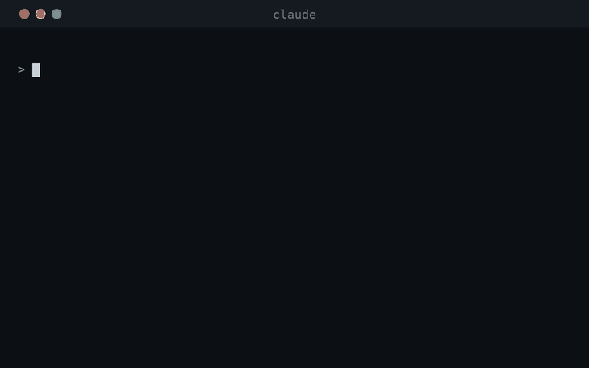
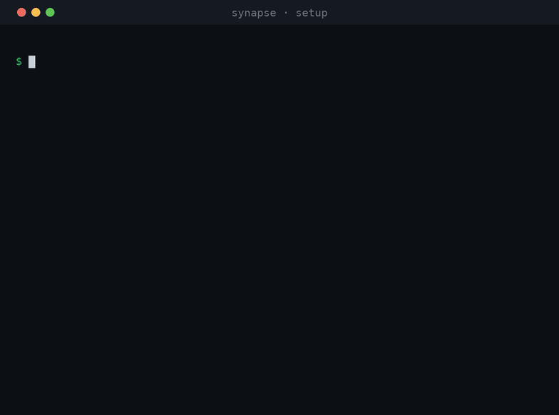

# Synapse

Self-hosted long-term memory for AI coding agents. Synapse captures Claude Code (and Cursor)
session transcripts, structures them into retrievable episodes plus a knowledge graph, and
serves both back over MCP as one ranked result.

**The problem it solves:** Claude Code sessions have no memory across restarts. Every new
session starts cold. Synapse indexes what happened in past sessions so a fresh one can recall
what was decided, built, and tried weeks ago.

Your memory data and the whole serving stack live on your own hardware — no third-party
service holds your history. The default pipeline does call paid APIs, though: Voyage for
embeddings and rerank (on every ingest *and* every recall), and Anthropic for extraction (a
Claude subscription token, an `ANTHROPIC_API_KEY`, or any OpenAI-compatible endpoint).
Extraction cost scales with how much you ingest — backfilling months of history is the one
large spend. The bundled `local-inference` profile plus a local LLM runs with zero external
accounts; retrieval quality was tuned on the Voyage stack, so expect a drop.

## Demo

The recall flow, using the repository's bundled example transcript
([`docs/example-transcript.json`](docs/example-transcript.json), so it reproduces exactly): a
fresh session asks a question and Synapse answers from an earlier session, fusing
knowledge-graph facts with the original episode.



## Benchmark

**83.6%** on [LongMemEval-S](https://github.com/xiaowu0162/LongMemEval) (500 questions,
official gpt-4o reader + judge), using the deployed pipeline end to end — no bench-side
content injection. Strongest categories: temporal reasoning 82.0%, knowledge-update 83.3%,
single-session recall 96–100%. For reference, Zep/Graphiti reports 71.2%, Mastra 84.2%
on the same reader class.

## How it works

```
Claude Code session
   │  Stop hook ships a bounded transcript tail
   ▼
POST /ingest ──► episodes (Postgres) ──► sliding-window chunks ──► KG fact extraction (Haiku)
                                                                         │
session asks synapse:recall ──► MCP server fuses, in parallel:           ▼
   • reranked episode leg (BM25 + vector)                          knowledge graph
   • knowledge-graph fact leg (vector + BM25 + 1-hop)               (Postgres)
   • web-research leg
   • bitemporal history leg ("what was true then vs now")
   ▼
compact, ranked result
```

1. A `Stop` hook pushes the tail of each session transcript to `/ingest` — detached, never
   blocking the turn.
2. `/ingest` dedups by a stable per-turn id — and skips byte-identical replays of turns
   already stored in the project (retry/re-import guard) — then appends genuinely-new
   turns as **episodes**.
3. A background poller groups episodes into overlapping **chunks** and mines them for
   entities and bitemporal facts — the **knowledge graph**, in Postgres.
4. `recall()` runs its legs in parallel (reranked episodes, KG facts, timeline events,
   web research, preferences, fact history) and returns a compact, ranked result.

Architecture, design decisions, and the measurements behind them:
[ARCHITECTURE.md](./ARCHITECTURE.md).

## What's in the box

- **Episodic memory** — one episode per human turn, served by a deep fetch (100 candidates
  per leg) plus a Voyage cross-encoder rerank. The retrieval workhorse for broad and needle
  queries alike.
- **Knowledge graph** — entities and bitemporal `RELATES_TO` fact edges in Postgres; the
  relational/multi-hop specialist. Facts are never deleted: contradictions invalidate the
  old edge and write a new one, which powers a "what changed" history leg.
- **Timeline** — an append-only log of dated point-events ("shipped X", "decided Y") mined
  from turns by an LLM gate and fed by git commits, serving "when / in what order" questions.
  A re-told happening confirm-merges into its existing row (an LLM reads both source turns,
  both presentation orders must agree) instead of duplicating; each event carries a
  `personal`/`technical` domain label so personal-scope queries exclude work noise; and
  happenings narrated inside quoted third-party material (someone else's email, a pasted
  transcript, an article) are never logged as the user's own.
- **Web-research capture** — WebFetch/Exa/Firecrawl/search results are captured and embedded
  so past research is recallable.
- **MCP server** — FastMCP over streamable HTTP (tool list [below](#mcp-tools)).
- **Claude Code plugin** — ingest + recall wiring, plus a nightly dream→skills lane that
  mines your transcripts to maintain a self-improving skill library, with opt-in two-way
  skill sync (`SYNAPSE_SKILLS_SYNC=1`). See [plugin/README.md](./plugin/README.md).

## Stack

- **Storage:** PostgreSQL (ParadeDB image) for everything — episodes, chunks, the queue, the
  web store, and the knowledge graph.
- **Vector search:** pgvector `halfvec` HNSW (2048 dims by default; width is fixed at
  first-boot schema provisioning via `SYNAPSE_EMBED_DIMS`).
- **Full-text search:** ParadeDB `pg_search` (BM25), fused with vector via reciprocal-rank
  fusion.
- **Embeddings + rerank:** Voyage AI by default (`voyage-4-large`, 2048 dims, and
  `rerank-2.5-lite`). Pluggable: any OpenAI-compatible `/embeddings` endpoint plus any
  TEI/Infinity/Cohere-shape `/rerank` server, or the bundled `local-inference` compose
  profile (see `.env.example`). Published retrieval quality was measured on the Voyage
  stack, and the rerank leg matters — `SYNAPSE_RERANK_PROVIDER=none` degrades recall to
  fusion-only ordering.
- **Extraction LLM:** Claude Haiku 4.5 by default, via `claude-agent-sdk` with a Claude
  subscription token or an `ANTHROPIC_API_KEY`. Set `SYNAPSE_LLM_PROVIDER=openai` to point
  at any OpenAI-compatible `/chat/completions` endpoint (OpenRouter, a local model, etc.).
- **MCP:** FastMCP, streamable HTTP, port 8765.
- **Language:** Python 3.12, managed with `uv`.

> An earlier version stored the graph in FalkorDB. The graph now lives in Postgres
> (`ingestion/kg_client.py`); FalkorDB has been decommissioned.

## Quick start

The whole install, end to end — clone, configure, `compose up`, wire up the plugin:



Single box, everything local:

```bash
git clone <this-repo> synapse && cd synapse
cp .env.example .env             # then fill in the required values below
docker compose up -d --build     # builds the image, starts Postgres + poller + MCP server
```

The images build locally from public bases (no registry auth), and the schema is applied
automatically on Postgres's first boot.

Required configuration (in `.env`):

- `SYNAPSE_DB_PASSWORD` — password for the bundled Postgres (must match the one in the DSN).
- `SYNAPSE_DB_URL` — Postgres DSN; the `.env.example` default just needs the password
  filled in.
- `VOYAGE_API_KEY` — Voyage AI key (embeddings + rerank). Not needed if you configure an
  alternative backend (`SYNAPSE_EMBED_*` / `SYNAPSE_RERANK_*` in `.env.example`, e.g. the
  `local-inference` profile).
- `CLAUDE_CODE_OAUTH_TOKEN` **or** `ANTHROPIC_API_KEY` — auth for the extraction LLM (the
  subscription token wins if both are set).

Optional knobs (`SYNAPSE_INGEST_TAIL`, `POLL_INTERVAL_SECONDS`, recall-serving tuning such
as the shadow-phase `SYNAPSE_RECALL_FLOOR` / `SYNAPSE_RECALL_FLOOR_ENFORCE` abstention
floor, and more) are listed in
[ARCHITECTURE.md §13](./ARCHITECTURE.md#13-configuration). If the default ports are taken,
set `MCP_PORT` and/or `POSTGRES_HOST_PORT` in `.env`. Set `LOGFIRE_TOKEN` to stream traces
to [Pydantic Logfire](https://logfire.pydantic.dev); leave it blank and telemetry is fully
off.

Then install the [plugin](./plugin/README.md) on each Claude Code machine so sessions feed
and query the server automatically. The repo ships its own marketplace manifest, so there is
nothing to publish:

```
/plugin marketplace add kraft87/synapse
/plugin install synapse@synapse
```

Install prompts for your `SYNAPSE_URL` (`http://localhost:8765` for the local quickstart)
and an optional token, then run `/reload-plugins`. Backfill months of past sessions in one
shot with `! synapse-import` (see
[Import your existing sessions](#import-your-existing-sessions)).

### Verify your install

```bash
# 1. Ship a test transcript (≥4 turns) to the server:
curl -sX POST localhost:8765/ingest -H 'Content-Type: application/json' \
  -d @docs/example-transcript.json
# 2. Wait one poll cycle (up to ~5 minutes), then ask for it back:
curl -sX POST localhost:8765/recall -H 'Content-Type: application/json' \
  -d '{"query": "what caching layer did we pick for the demo app search service"}'
```

Two timing expectations that look like bugs but aren't: **episodes** appear within seconds
of ingest, but **knowledge-graph facts** are extracted from 4-turn sliding windows — a
session with fewer than 4 human turns produces episodes and an *empty graph*. And extraction
runs on a poll cycle (`POLL_INTERVAL_SECONDS`, default 300), so first facts land a few
minutes after ingest, not instantly.

### Import your existing sessions

A fresh install doesn't have to start cold. If you've been using Claude Code, months of
transcripts already sit in `~/.claude/projects` — import them once and `recall()` knows your
history on day one:

```
! synapse-import        # inside a Claude Code session (the plugin puts it on PATH)
```

It offers an optional date range (by each file's last-activity date), prints a summary
(file count, size, estimated turns), and asks for confirmation before sending anything —
importing runs KG extraction on your configured LLM for every new turn, which consumes
subscription usage or API credits roughly in proportion to the turn count, so bounding a
first import by date bounds the spend. The server dedups turns by `span_id`, so Ctrl-C
and re-running are always safe: an interrupted import resumes where it left off.

Cursor history can be imported too, but only as a server-side dev path for now
(`python -m ingestion.cursor_sqlite_backfill`).

### Upgrading

First-boot init never re-runs on an existing data volume. To bring an existing database up
to date, run [`scripts/apply_schema.sh`](./scripts/apply_schema.sh) (the single source of
truth for migration order) against it — see the script's header for caveats.

Every service verifies at boot that the database schema matches the code (the script
stamps the applied version; a mismatch refuses to start with instructions rather than
failing mid-request). So the upgrade order is: pull, run `apply_schema.sh`, restart.
`SYNAPSE_SCHEMA_CHECK=0` skips the guard.

Releases are tagged (`v0.8.1`, ...). `main` is kept releasable, but for a known-good
build check out the latest tag; a change that needs a migration or renames an env var
gets a release note saying so.

## MCP tools

- `recall(query, project=None, session_focus=None, group_id="technical")` — the primary
  retrieval tool: reranked episodes + KG facts + timeline + web + history. Served episode
  passages carry a `role` label (`user` / `assistant` / `mixed`) so the caller can weight a
  human-stated fact over the agent's own past output.
- `recall_episodes(query, project=None, limit=5)` — raw episode drill-down.
- `recall_timeline(query=None, since=None, until=None, group_id=None)` — dated events for
  "when / in what order" questions; `group_id="personal"` scopes to life events, excluding
  technical/work noise.
- `fetch_episode(episode_ids)` — expand full turns by id (from a prior recall).
- `remember(content, project=None)` — write a manual memory and extract it into the graph.
- `list_projects()` — per-project episode counts and last activity.
- `query_graph(query)` — experimental natural-language graph query.

## Auth

The MCP server supports two auth modes at once, so machines and the claude.ai web connector
can share one server:

- **Machine bearer** — a static token the plugin's hooks send to `/ingest`, `/recall`, and
  `/mcp`. Headless boxes set it directly.
- **GitHub OAuth** — for the claude.ai web connector and the plugin's `synapse-login`. Login
  defaults to the device flow (RFC 8628): approve a short code at `github.com/login/device`
  from any device — no same-host browser — and the machine token is stored for you
  (`--browser` keeps the legacy loopback flow). Access is gated to an allowlist of GitHub
  users (`ALLOWED_GITHUB_USERS`); the GitHub OAuth App needs "Enable Device Flow" on.

With no token configured the server runs open, which is fine for a purely local instance. A
central instance can be exposed to claude.ai over a Cloudflare tunnel; the MCP server
handles auth itself, so no separate proxy is needed.

## Status

Single-user, self-hosted, and actively used in a homelab. It is not packaged as a turnkey
product yet, but the server, the plugin, and the install path all work end to end.
