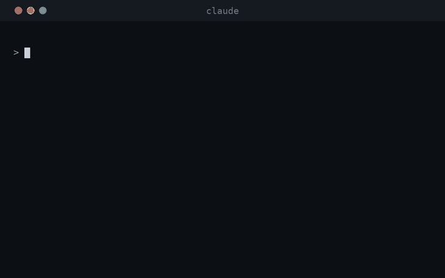
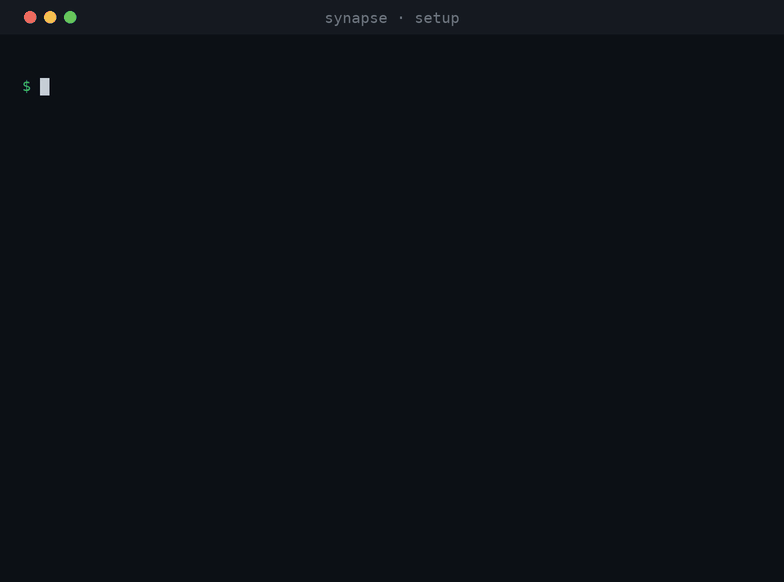

# Synapse

Self-hosted long-term memory for AI coding agents. Synapse captures Claude Code (and Cursor)
session transcripts, structures them into retrievable episodes plus a knowledge graph, and
serves both back over MCP as one ranked result.

**The problem it solves:** Claude Code sessions have no memory across restarts. Every new
session starts cold. Synapse indexes what happened in past sessions so a fresh one can recall
what was decided, built, and tried weeks ago.

Your memory data and the whole serving stack live on your own hardware — no third-party
service holds your history. The default pipeline does call paid APIs, though: Voyage for
embeddings and rerank (on every ingest *and* every recall), and Anthropic for extraction (a
Claude subscription token, an `ANTHROPIC_API_KEY`, or any OpenAI-compatible endpoint).
Extraction cost scales with how much you ingest — backfilling months of history is the one
large spend. The bundled `local-inference` profile plus a local LLM runs with zero external
accounts; retrieval quality was tuned on the Voyage stack, so expect a drop.

## Demo

The recall flow, using the repository's bundled example transcript
([`docs/example-transcript.json`](docs/example-transcript.json), so it reproduces exactly): a
fresh session asks a question and Synapse answers from an earlier session, fusing
knowledge-graph facts with the original episode.



## Benchmark

**84.8%** on [LongMemEval-S](https://github.com/xiaowu0162/LongMemEval) (500 questions,
official gpt-4o reader + judge), using the deployed pipeline end to end.
Strongest categories: temporal reasoning 82.7%, knowledge-update 84.6%,
single-session recall 95–97%. For reference, Zep/Graphiti reports 71.2%, Mastra 84.2%
on the same reader class.

## How it works

```
Claude Code session
   │  Stop hook ships a bounded transcript tail
   ▼
POST /ingest ──► episodes (Postgres) ──► sliding-window chunks ──► KG fact extraction (Haiku)
                                                                         │
session asks synapse:recall ──► MCP server fuses, in parallel:           ▼
   • reranked episode leg (BM25 + vector)                          knowledge graph
   • knowledge-graph fact leg (vector + BM25 + 1-hop)               (Postgres)
   • web-research leg
   • bitemporal history leg ("what was true then vs now")
   ▼
compact, ranked result
```

A `Stop` hook pushes the tail of each session transcript to `/ingest`, detached, never
blocking the turn; genuinely-new turns are stored as episodes. A background poller groups
episodes into overlapping chunks and mines them for entities and bitemporal facts. `recall()`
runs its legs in parallel and returns one compact, ranked result.

Architecture, design decisions, and the measurements behind them:
[ARCHITECTURE.md](./ARCHITECTURE.md).

## Quick start

The whole install, end to end — clone, configure, `compose up`, wire up the plugin:



Single box, everything local:

```bash
git clone https://github.com/kraft87/synapse.git synapse && cd synapse
cp .env.example .env                 # fill in DB password + DSN, machine token, API keys
docker compose up -d --build         # builds the image, starts Postgres + poller + MCP server
docker compose exec mcp-server synapse-admin bootstrap "this laptop"
```

That last command prints a one-time device token. Every machine is served according to its
own device token, so this step is not optional: paste the printed token as the "Synapse
token" when you install the plugin.

```
/plugin marketplace add kraft87/synapse
/plugin install synapse@synapse
```

The install prompts for your `SYNAPSE_URL` (`http://localhost:8765` for the local
quickstart), the token above, and this machine's role. Then run `/reload-plugins`.

Required values, verification steps, importing your existing history, upgrades, and
troubleshooting: **[docs/install.md](docs/install.md)**.

## Docs

- **[docs/install.md](docs/install.md)** — the full install: required configuration, first
  device, verification, importing months of past sessions, ports, upgrading, troubleshooting.
- **[docs/auth.md](docs/auth.md)** — machine token vs device tokens, enrollment, what a
  restricted machine is served, GitHub OAuth and OIDC for the claude.ai connector.
- **[docs/tools.md](docs/tools.md)** — the MCP tool surface, the plugin's hooks, and every
  plugin configuration variable.
- **[docs/features.md](docs/features.md)** — what's in the box, and the stack it runs on.
- **[ARCHITECTURE.md](./ARCHITECTURE.md)** — the design doc: pipelines, schema, decisions,
  measurements, full server configuration reference.
- **[plugin/README.md](./plugin/README.md)** — the Claude Code plugin.
  **[plugin-codex/README.md](./plugin-codex/README.md)** — the Codex CLI equivalent.
- Design specs: [audience scoping](docs/audience-scoping-spec.md),
  [session drill-down](docs/session-drilldown-spec.md),
  [dashboard contract](docs/dashboard-contract.md).

## Status

Single-user, self-hosted, and actively used in a homelab. It is not packaged as a turnkey
product yet, but the server, the plugin, and the install path all work end to end.
